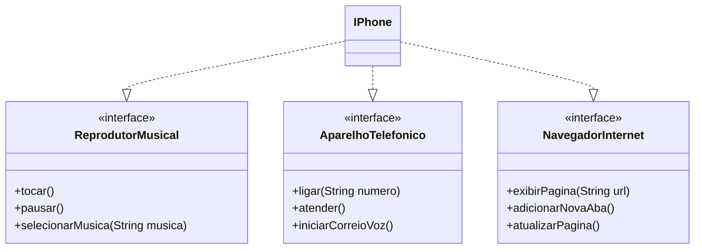

# Modelagem e Diagramação de um Componente iPhone

Este repositório contém a modelagem UML e a implementação em Java do componente iPhone, conforme o desafio da DIO.

## Funcionalidades Modeladas

1.  **Reprodutor Musical**
    *   `tocar()`
    *   `pausar()`
    *   `selecionarMusica(String musica)`
2.  **Aparelho Telefônico**
    *   `ligar(String numero)`
    *   `atender()`
    *   `iniciarCorreioVoz()`
3.  **Navegador na Internet**
    *   `exibirPagina(String url)`
    *   `adicionarNovaAba()`
    *   `atualizarPagina()`

## Diagrama UML

## Estrutura de Arquivos

*   `src/interfaces/`: Contém as interfaces das funcionalidades.
*   `src/model/`: Contém a classe `IPhone` que implementa as interfaces.
